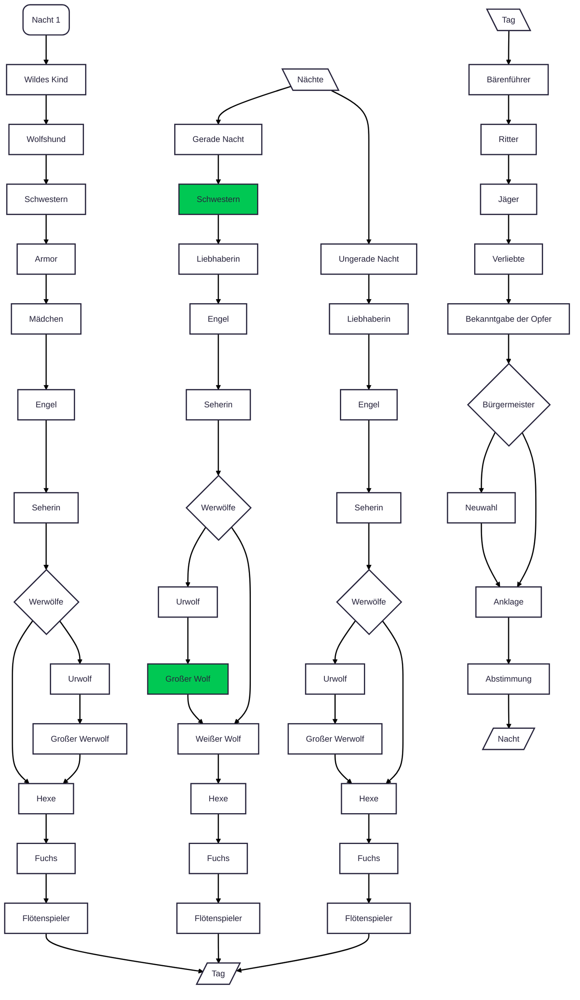

```mermaid
---
config:
  theme: redux
---
flowchart TD
    n1["Nacht 1"] --> n2["Wildes Kind"]
    n2 --> n3["Wolfshund"]
    n3 --> n4["Schwestern"]
    n4 --> n5["Armor"]
    n5 --> n6["Mädchen"]
    n6 --> n7["Engel"]
    n7 --> n8["Seherin"]
    n8 --> n9["Werwölfe"]
    n9 --> n10["Hexe"] & n11["Urwolf"]
    n11 --> n12["Großer Werwolf"]
    n12 --> n10
    n10 --> n13["Fuchs"]
    n13 --> n14["Flötenspieler"]
    n14 --> n15["Tag"]
    n16["Nächte"] --> n17["Gerade Nacht"] & n18["Ungerade Nacht"]
    n17 --> n19["Schwestern"]
    n19 --> n20["Liebhaberin"]
    n20 --> n21["Engel"]
    n21 --> n22["Seherin"]
    n22 --> n23["Werwölfe"]
    n23 --> n24["Urwolf"] & n25["Weißer Wolf"]
    n24 --> n26["Großer Wolf"]
    n26 --> n25
    n25 --> n27["Hexe"]
    n27 --> n28["Fuchs"]
    n28 --> n29["Flötenspieler"]
    n29 --> n15
    n30["Liebhaberin"] --> n31["Engel"]
    n31 --> n32["Seherin"]
    n32 --> n33["Werwölfe"]
    n18 --> n30
    n35["Urwolf"] --> n36["Großer Werwolf"]
    n36 --> n34["Hexe"]
    n34 --> n37["Fuchs"]
    n37 --> n38["Flötenspieler"]
    n33 --> n35 & n34
    n38 --> n15
    n39["Tag"] --> n40["Bärenführer"]
    n40 --> n41["Ritter"]
    n41 --> n42["Jäger"]
    n42 --> n43["Verliebte"]
    n43 --> n44["Bekanntgabe der Opfer"]
    n44 --> n45["Bürgermeister"]
    n45 --> n46["Neuwahl"] & n47["Anklage"]
    n46 --> n47
    n47 --> n48["Abstimmung"]
    n48 --> n49["Nacht"]
    n1@{ shape: rounded}
    n9@{ shape: diam}
    n15@{ shape: in-out}
    n16@{ shape: out-in}
    n23@{ shape: diam}
    n30@{ shape: rect}
    n31@{ shape: rect}
    n32@{ shape: rect}
    n33@{ shape: diam}
    n35@{ shape: rect}
    n36@{ shape: rect}
    n34@{ shape: rect}
    n37@{ shape: rect}
    n38@{ shape: rect}
    n39@{ shape: out-in}
    n45@{ shape: diam}
    n49@{ shape: in-out}
    style n19 fill:#00C853
    style n26 fill:#00C853
```